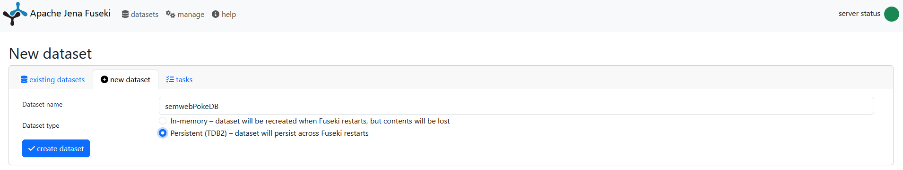

# Pokémon RDF Project

## Description
This project creates a semantic web representation of Pokémon data using RDF. It fetches Pokemon information, processes infoboxes, generates RDF triples, validates them using SHACL, and integrates with an RDF triplestore such as Apache Jena Fuseki.

- All the generated RDF triples can be found in the file `pokemon_output.ttl`.
- The SHACL shapes used for validation can be found in the file `src/main/resources/shacl/shapes.ttl`.
- The vocabulary used in the project is defined in `src/main/resources/vocabulary/vocabulary.ttl`.

---

# Installation and Setup

## 1. **Clone the Repository**
Before starting, clone the GitHub repository containing the project. This includes both the triplestore and front-end parts:

```sh
git clone https://github.com/Boruus/Semantic-Web-Projet.git
cd Semantic-Web-Projet
```

---

## Triplestore Setup

### 1. **Requirements**
- Java 8 or later.
- Apache Jena and the Fuseki server.
- Node.js and npm (Node Package Manager).

### 2. **How to Run**
1. Start Apache Jena Fuseki.
2. Open your browser and navigate to `http://localhost:3030`.
3. Create a dataset with this name: **semwebPokeDB**.
   
   
4. Navigate to `src/main/java/semweb/PokemonRDFGenerator` and execute the file `PokemonRDFGenerator.java` to generate RDF triples. The loading process may take between 5 and 15 minutes depending on your internet connection. They will be saved in the file `pokemon_output.ttl`. 
5. Run `RdfValidator.java` to validate the RDF against SHACL shapes.

---

## Front-End Setup

### 1. **Requirements**
- Node.js and npm (Node Package Manager).

You can download and install Node.js from [here](https://nodejs.org/en/download). Note that npm is included with Node.js. If your PC does not recognize npm after installing Node.js, you may need to restart your computer.


### 2. **How to Run**
1. Navigate to the front-end directory:
   ```sh
   cd semweb-front
   ```

2. Install Node.js dependencies:
   ```sh
   npm install
   ```

3. Start the Vue.js application:
   ```sh
   npm run serve
   ```

4. Open your browser and go to:
   ```sh
   http://localhost:8080
   ```

---

# File Descriptions

## Triplestore Files

### 1. `FusekiConnection.java`
- Handles the connection to an Apache Jena Fuseki triplestore.
- **Functions**:
  - Inserts RDF data into a Fuseki server.
- **Configuration**:
  - Set server URLs and dataset details within this file.

### 2. `PokemonInfoboxRDFGenerator.java`
- Extracts structured data from Pokémon infoboxes.
- Converts the data into RDF triples, aligning with `schema.org` and custom vocabulary.

### 3. `PokemonNames.java`
- Provides utility functions for handling Pokémon names.
- **Features**:
  - Maps multilingual Pokémon names.
  - Validates name formats.

### 4. `PokemonPagesFetcher.java`
- Fetches Pokémon-related pages using the MediaWiki API.
- **Functions**:
  - Retrieves infobox content from Pokémon wiki pages.
  - Extracts external links and related page information.

### 5. `PokemonRDFGenerator.java`
- Orchestrates the RDF generation process.
- Uses data from `PokemonPagesFetcher` and `PokemonInfoboxRDFGenerator`.
- Produces RDF models compatible with SHACL validation.

### 6. `RdfValidator.java`
- Validates RDF triples against SHACL shapes.
- Ensures that the generated triples conform to predefined schema rules.

### 7. `TsvReader.java`
- Reads TSV files containing multilingual Pokémon names.
- Maps Pokémon IDs to their names in different languages.
- **Usage**:
  - Input multilingual Pokémon names from external sources for RDF generation.

### 8. `UtilsFunctions.java`
- Contains utility functions for:
  - Resolving redirects in MediaWiki pages.
  - Mapping Pokémon names to their unique IDs.
  - Converting languages into ISO codes.

---

# Front-End Components

## Vue.js Components

### Main Components
- **App.vue**: The main component that manages navigation between different pages.
- **HomePage.vue**: The project's homepage with a description and objectives of the project.
- **PokeListPage.vue**: Displays a list of Pokémon pages. Clicking on a page redirects the user to the details of that page.
- **PokeListCardsPage.vue**: Displays a list of Pokémon cards. Clicking on a page redirects the user to the details of that page.
- **PokeListTuplesPage.vue**: Displays a list of RDF tuples (predicate-object) for Pokémon.

### Additional Pages
- **AttacksPage.vue**: Displays a list of Pokémon attacks (under development).
- **RegionsPage.vue**: Displays a list of Pokémon regions (under development).
- **Credit.vue**: Displays the project credits.
- **PokemonDetailPage.vue**: Displays the details of a selected Pokémon page.

## JavaScript Files

### Core Files
- **main.js**: Main entry point of the Vue.js application.
- **router.js**: Defines the routes for navigation between different pages of the application.
- **server.js**: An Express server that handles CORS requests and runs the Java RDF generator.

## Navigation
- **Home**: Homepage with a description of the project.
- **Pokémon**: Displays a list of Pokémon pages. Click on a page to see the details.
- **Pokémon Cards**: Displays a list of Pokémon cards. Click on a page to see the details.
- **Tuples**: Displays a list of RDF tuples (predicate-object) for Pokémon.
- **Attacks**: Displays a list of Pokémon attacks (under development).
- **Regions**: Displays a list of Pokémon regions (under development).
- **Credit**: Displays the project credits.

## RDF Generation (Under Development)
To run the RDF generator, click on the "Run Pokemon RDF Generator" button on the main page. This will send a request to the Express server to run the Java `PokemonRDFGenerator` program.

---

# Developers

- **Boris Trombert**
- **Mathias CHANE-WAYE**

## Supervision

- **Antoine Zimmermann**

## Resources

- **Bulbapedia**
- **Infobox Templates**
